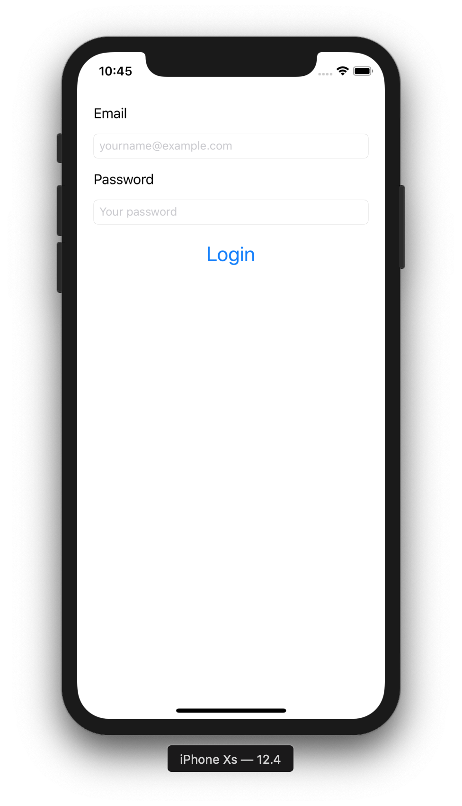

# mad-fe-2
Login Screen Exercise



## Instructions, Requirements and Hints

### Setting up the project
- Create a new App in Xcode, use the App iOS Application template
- When creating the project, make sure Swift Testing is checked, but uncheck Storage. We won't be using unit tests for this exercise, but we will be in future exercises that build upon this one.

### Building the layout
- Open the ContentView file. Create a layout similar to the one in the screenshot above.
- Use **Text**, **TextField** and **Button** to build the form
- Use HStack and VStack to ensure the layout works on all device sizes and orientations.
- There can be a crucial problem with this user interface. Any idea what that could be? (Hint: What happens when we tap one of the TextField while in landscape mode?) We won’t fix in this exercise yet, but it'll be tackled in a future exercise.

### Setting up the TextFields
- The TextField Content Type and Keyboard Type should be properly set to the content they contain (email/password). Enable secure text entry for the password field by using a SecureField. To check if everything works, press CMD+K in the iOS Simulator to show the software keyboard.
- When pressing the return key, the appropriate action should happen. If the email textfield is currently selected, the password textfield should be selected afterwards. If the password textField is currently selected, the same action as pressing the login button should be called. 
- Use @State variables for storing and accessing model data (username and password)

### Implement the login action
- Use the Swift guard statement (you can read up on it here) to implement client-side validation of login data. No need to verify the email address, for this exercise, it's enough to make sure that the text in the textfield is a non-empty string. If any of the textFields is empty, add some kind of indication that something is missing. For example, you could add another Text to the layout that has its isHidden property set to true and only appears after the verification fails. Or you could present an Alert that contains an error message.
- For now, we won't actually be doing a real login to a webservice yet. Instead, simply check if the email and password match a hardcoded email/password combo.
- To simulate the asynchronous nature of the login, use the following code snippet:

```
DispatchQueue.main.asyncAfter(deadline: .now() + 2) {
  // This code executes after 2 seconds
  // Check here if the login was successful
}
```

- Present an Alert when the fake login is done with a success or error message. You can read up on how to create one here.
- We don't want the user to be able to log in twice at the same time. Make sure that while the fake login is running, all the UI elements are disabled (set isEnabled to false).
- While the fake login is running, the user should understand what's going on. Add feedback by creating a ProgressView in your storyboard. Make sure that it's initially hidden. Show it before calling the fake log in and hide it after it's done.
- Don't forget to clean up and re-enable the UI elements and hide the progress view once the login is done.
